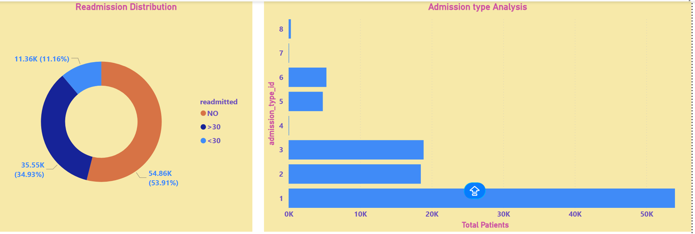
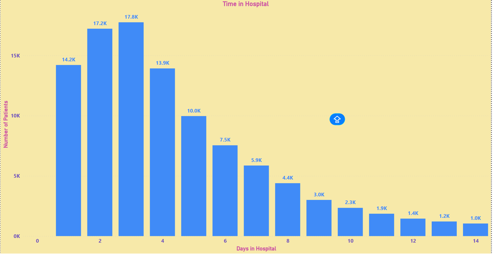
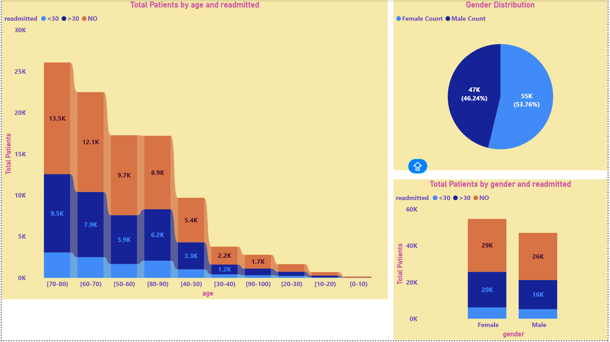
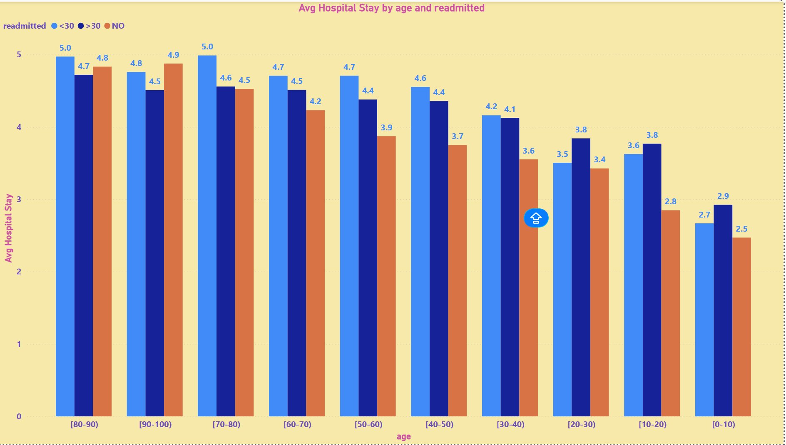
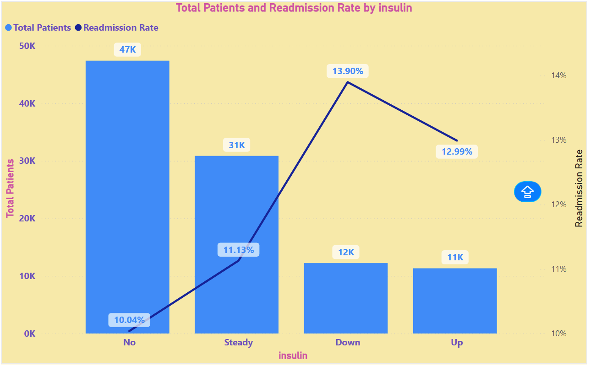

# Healthcare Readmission Analytics

## Overview

This project analyzes hospital patient data to understand **readmission patterns** and identify key factors influencing **30-day readmissions**.

It combines:

* Exploratory Data Analysis (EDA)
* Machine Learning (Logistic Regression & XGBoost)
* Interactive Dashboard (Power BI)

The goal is to provide **data-driven insights** that can help hospitals reduce readmission rates and improve patient care.

---

## Business Problem

Hospital readmissions are costly and often preventable.

This project answers:

* Which patients are more likely to be readmitted?
* How do demographics and treatments impact readmission?
* What factors increase hospital stay and risk?

---

## Dataset

* Source: Healthcare (Diabetes Readmission Dataset)
* Records: 100,000+ patient encounters
* Features include:

  * Demographics: `age`, `gender`, `race`
  * Clinical: `diag_1`, `diag_2`, `num_medications`
  * Hospitalization: `time_in_hospital`, `admission_type_id`
  * Target: `readmitted`

---

## Tech Stack

* Python: Pandas, NumPy, Matplotlib, Seaborn
* Machine Learning: Scikit-learn, XGBoost
* Visualization: Power BI
* Environment: Virtual Environment (venv)
* Version Control: Git & GitHub

---

## Exploratory Data Analysis (EDA)

Key analyses performed:

* Age distribution of patients
* Gender & race-based insights
* Hospital stay duration vs readmission
* Medication and diagnosis patterns

### Key Insights

* Patients with longer hospital stays have higher readmission risk
* Certain age groups show significantly higher readmission rates
* Medication count and inpatient visits correlate with readmission

---

## Machine Learning Models

### Logistic Regression

* Baseline model
* Interpretable coefficients

### XGBoost (Final Model)

* Handles non-linear relationships
* Better performance on structured healthcare data

### Evaluation Metrics

* Accuracy
* Precision / Recall
* ROC-AUC Score

---

## Power BI Dashboard

The dashboard provides:

* KPI Metrics (Total Patients, Readmission Rate)

* Demographic Analysis (Age, Gender)

* Readmission Trends

* Interactive Filters (Slicers)

---

## Setup Instructions

### 1. Clone the repository

cd healthcare_readmission_analytics

### 2. Create virtual environment

python3 -m venv venv
source venv/bin/activate

### 3. Install dependencies

pip install -r requirements.txt

### 4. Run Jupyter Notebook

python3 -m notebook

---

##  Results

* Identified key drivers of patient readmission
* Built predictive models for classification
* Delivered business insights via interactive dashboard

---

##  Business Impact

* Helps hospitals reduce readmission penalties
* Supports better patient monitoring strategies
* Enables data-driven healthcare decisions

---

##  Future Improvements

* Feature engineering (clinical risk scoring)
* Model deployment (API)
* Real-time analytics integration

